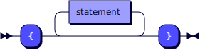
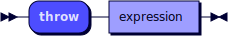
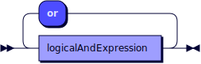
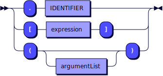
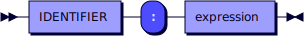

**functionProgram:**


```
functionProgram
         ::= functionDeclaration* EOF
```

**functionDeclaration:**


```
functionDeclaration
         ::= 'function' functionName '(' parameterList? ')' ( '->' dataType )? block
```

referenced by:

* functionProgram

**functionName:**


```
functionName
         ::= IDENTIFIER
```

referenced by:

* functionDeclaration

**parameterList:**


```
parameterList
         ::= parameter ( ',' parameter )*
```

referenced by:

* functionDeclaration

**parameter:**


```
parameter
         ::= IDENTIFIER ':' dataType
```

referenced by:

* parameterList

**dataType:**


```
dataType ::= 'integer'
           | 'decimal'
           | 'boolean'
           | 'text'
           | 'list'
           | 'object'
           | 'void'
```

referenced by:

* functionDeclaration
* parameter

**block:**



```
block    ::= '{' statement* '}'
```

referenced by:

* forEachStatement
* forRangeStatement
* functionDeclaration
* ifStatement
* tryCatchStatement
* whileStatement

**statement:**


```
statement
         ::= ifStatement
           | whileStatement
           | forEachStatement
           | forRangeStatement
           | tryCatchStatement
           | throwStatement
           | 'break'
           | 'continue'
           | returnStatement
           | expressionStatement
```

referenced by:

* block

**ifStatement:**


```
ifStatement
         ::= 'if' expression block ( 'else_if' expression block )* ( 'else' block )?
```

referenced by:

* statement

**whileStatement:**


```
whileStatement
         ::= 'while' expression block
```

referenced by:

* statement

**forEachStatement:**


```
forEachStatement
         ::= 'for' 'each' IDENTIFIER 'in' expression block
```

referenced by:

* statement

**forRangeStatement:**


```
forRangeStatement
         ::= 'for' IDENTIFIER 'from' expression 'to' expression ( 'step' expression )? block
```

referenced by:

* statement

**tryCatchStatement:**


```
tryCatchStatement
         ::= 'try' block ( 'catch' '(' IDENTIFIER ')' block )+
```

referenced by:

* statement

**throwStatement:**



```
throwStatement
         ::= 'throw' expression
```

referenced by:

* statement

**returnStatement:**


```
returnStatement
         ::= 'return' expression?
```

referenced by:

* statement

**expressionStatement:**


```
expressionStatement
         ::= expression
```

referenced by:

* statement

**expression:**


```
expression
         ::= ( leftHandSide '=' )* logicalOrExpression
```

referenced by:

* argumentList
* expressionStatement
* forEachStatement
* forRangeStatement
* ifStatement
* leftHandSide
* listLiteral
* objectPair
* postfixPart
* primaryExpression
* returnStatement
* throwStatement
* whileStatement

**logicalOrExpression:**



```
logicalOrExpression
         ::= logicalAndExpression ( 'or' logicalAndExpression )*
```

referenced by:

* expression

**logicalAndExpression:**


```
logicalAndExpression
         ::= equalityExpression ( 'and' equalityExpression )*
```

referenced by:

* logicalOrExpression

**equalityExpression:**


```
equalityExpression
         ::= relationalExpression ( ( '==' | '!=' ) relationalExpression )*
```

referenced by:

* logicalAndExpression

**relationalExpression:**


```
relationalExpression
         ::= additiveExpression ( ( '<' | '<=' | '>' | '>=' ) additiveExpression )*
```

referenced by:

* equalityExpression

**additiveExpression:**


```
additiveExpression
         ::= multiplicativeExpression ( ( '+' | '-' ) multiplicativeExpression )*
```

referenced by:

* relationalExpression

**multiplicativeExpression:**


```
multiplicativeExpression
         ::= unaryExpression ( ( '*' | '/' | '%' ) unaryExpression )*
```

referenced by:

* additiveExpression

**unaryExpression:**


```
unaryExpression
         ::= ( 'not' | '-' )* postfixExpression
```

referenced by:

* multiplicativeExpression

**postfixExpression:**


```
postfixExpression
         ::= primaryExpression postfixPart*
```

referenced by:

* unaryExpression

**postfixPart:**



```
postfixPart
         ::= '.' IDENTIFIER
           | '[' expression ']'
           | '(' argumentList? ')'
```

referenced by:

* postfixExpression

**leftHandSide:**


```
leftHandSide
         ::= IDENTIFIER ( '.' IDENTIFIER | '[' expression ']' )*
```

referenced by:

* expression

**argumentList:**


```
argumentList
         ::= expression ( ',' expression )*
```

referenced by:

* postfixPart

**primaryExpression:**


```
primaryExpression
         ::= literal
           | IDENTIFIER
           | '(' expression ')'
           | listLiteral
           | objectLiteral
```

referenced by:

* postfixExpression

**literal:**


```
literal  ::= 'null'
           | 'true'
           | 'false'
           | DECIMAL_LITERAL
           | INTEGER_LITERAL
           | STRING_LITERAL
```

referenced by:

* primaryExpression

**listLiteral:**


```
listLiteral
         ::= '[' ( expression ( ',' expression )* )? ']'
```

referenced by:

* primaryExpression

**objectLiteral:**


```
objectLiteral
         ::= '{' ( objectPair ( ',' objectPair )* )? '}'
```

referenced by:

* primaryExpression

**objectPair:**



```
objectPair
         ::= IDENTIFIER ':' expression
```

referenced by:

* objectLiteral

**IDENTIFIER:**


```
IDENTIFIER
         ::= [a-zA-Z_] [a-zA-Z0-9_]*
```

referenced by:

* forEachStatement
* forRangeStatement
* functionName
* leftHandSide
* objectPair
* parameter
* postfixPart
* primaryExpression
* tryCatchStatement

**INTEGER_LITERAL:**


```
INTEGER_LITERAL
         ::= DIGITS
```

referenced by:

* literal

**DECIMAL_LITERAL:**


```
DECIMAL_LITERAL
         ::= DIGITS ( '.' ( DIGITS [eE] [+#x2D]? )? | [eE] [+#x2D]? ) DIGITS
```

referenced by:

* literal

**STRING_LITERAL:**


```
STRING_LITERAL
         ::= '"' ( ESC | [^"\] )* '"'
```

referenced by:

* literal

**ESC:**


```
ESC      ::= '\\' [\/"bfnrt]
           | '\\u' HEX HEX HEX HEX
```

referenced by:

* STRING_LITERAL

**DIGITS:**


```
DIGITS   ::= [0-9] ( [0-9_]* [0-9] )?
```

referenced by:

* DECIMAL_LITERAL
* INTEGER_LITERAL

**HEX:**


```
HEX      ::= [0-9a-fA-F]
```

referenced by:

* ESC

## 
 <sup>generated by [RR - Railroad Diagram Generator][RR]</sup>

[RR]: https://www.bottlecaps.de/rr/ui