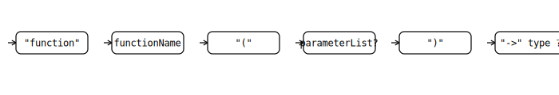

# FlowScriptFunctions — BNF (Markdown)

```ebnf
functionProgram      ::= { functionDeclaration } ;

functionDeclaration  ::= "function" functionName "(" [ parameterList ] ")" [ "->" type ] block ;
functionName         ::= IDENTIFIER ;

parameterList        ::= parameter { "," parameter } ;
parameter            ::= IDENTIFIER ":" type ;

type                 ::= "integer" | "decimal" | "boolean" | "text" | "list" | "object" | "void" ;

block                ::= "{" { statement } "}" ;

statement            ::= variableAssignment [";"]
                      | ifStatement
                      | whileStatement
                      | forEachStatement
                      | forRangeStatement
                      | breakStatement [";"]
                      | continueStatement [";"]
                      | returnStatement [";"]
                      | tryCatchStatement
                      | throwStatement [";"]
                      | expressionStatement [";"] ;

variableAssignment   ::= leftHandSide "=" expression ;
leftHandSide         ::= IDENTIFIER { memberAccess | indexAccess } ;
memberAccess         ::= "." IDENTIFIER ;
indexAccess          ::= "[" expression "]" ;

ifStatement          ::= "if" expression block { elseIfClause } [ "else" block ] ;
elseIfClause         ::= "else_if" expression block ;

whileStatement       ::= "while" expression block ;

forEachStatement     ::= "for" "each" IDENTIFIER "in" expression block ;

forRangeStatement    ::= "for" IDENTIFIER "from" expression "to" expression [ "step" expression ] block ;

breakStatement       ::= "break" ;
continueStatement    ::= "continue" ;

returnStatement      ::= "return" [ expression ] ;

tryCatchStatement    ::= "try" block { catchClause } [ "finally" block ] ;
catchClause          ::= "catch" "(" IDENTIFIER ")" block ;

throwStatement       ::= "throw" expression ;
expressionStatement  ::= expression ;

(* ---------- Expresiones (precedencia y asociatividad izquierda) ---------- *)

expression               ::= orExpression ;

orExpression             ::= andExpression { "or" andExpression } ;
andExpression            ::= equalityExpression { "and" equalityExpression } ;
equalityExpression       ::= relationalExpression { ( "==" | "!=" ) relationalExpression } ;
relationalExpression     ::= additiveExpression { ( "<" | ">" | "<=" | ">=" ) additiveExpression } ;
additiveExpression       ::= multiplicativeExpression { ( "+" | "-" ) multiplicativeExpression } ;
multiplicativeExpression ::= unaryExpression { ( "*" | "/" | "%" ) unaryExpression } ;

unaryExpression          ::= ( "not" | "-" ) unaryExpression
                          | postfixExpression ;

postfixExpression        ::= primaryExpression { postfixOp } ;
postfixOp                ::= "(" [ argumentList ] ")" | memberAccess | indexAccess ;

primaryExpression        ::= literal | IDENTIFIER | "(" expression ")" ;
argumentList             ::= expression { "," expression } ;

(* ---------- Literales ---------- *)

literal              ::= integerLiteral
                       | decimalLiteral
                       | booleanLiteral
                       | nullLiteral
                       | stringLiteral
                       | listLiteral
                       | objectLiteral ;

integerLiteral       ::= INTEGER_LITERAL ;
decimalLiteral       ::= DECIMAL_LITERAL ;
booleanLiteral       ::= "true" | "false" ;
nullLiteral          ::= "null" ;
stringLiteral        ::= STRING_LITERAL ;

listLiteral          ::= "[" [ expression { "," expression } ] "]" ;

objectLiteral        ::= "{" [ objectPair { "," objectPair } ] "}" ;
objectPair           ::= IDENTIFIER ":" expression ;

(* ---------- Léxicos de interés (referencia) ---------- *)

IDENTIFIER           ::= /[a-zA-Z_][a-zA-Z0-9_]*/ ;
INTEGER_LITERAL      ::= /-?[0-9][0-9_]*/ ;
DECIMAL_LITERAL      ::= /-?[0-9]+(\.[0-9]+)?([eE][+\-]?[0-9]+)?/ ;
STRING_LITERAL       ::= /" ( \\[btnr"\\] | \\u[0-9a-fA-F]{4} | [^"\\\r\n] )* "/ ;
```

---

## Diagramas

### `functionDeclaration`


### `statement`


### Precedencia de expresiones


---

## (Opcional) Diagramas Mermaid

> Si tu visor soporta Mermaid, estos ayudan a visualizar las reglas clave.

### `functionDeclaration`
```mermaid
flowchart LR
    A["function"] --> B[functionName]
    B --> C["("]
    C --> D{parameterList?}
    D --> E[")"]
    E --> F{ "->" type ? }
    F --> G[block]
```

### `statement`


### Precedencia de expresiones

