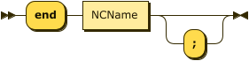
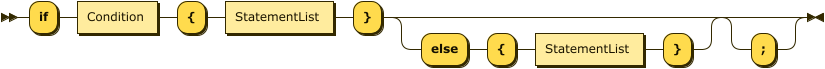
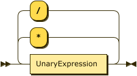

**Program:**


```
Program  ::= ( ImportStatement | GlobalVar | FunctionDecl | ProcessDecl )*
```

**ImportStatement:**


```
ImportStatement
         ::= ( 'import' | 'import_jar' ) StringLiteral ( 'as' NCName )? ';'?
```

referenced by:

* Program

**GlobalVar:**


```
GlobalVar
         ::= NCName '=' Expression ';'?
```

referenced by:

* Program

**FunctionDecl:**


```
FunctionDecl
         ::= 'function' NCName '(' ParamList? ')' ( '->' Type )? '{' StatementList '}' ';'?
```

referenced by:

* Program

**ParamList:**


```
ParamList
         ::= Param ( ',' Param )*
```

referenced by:

* FunctionDecl

**Param:**


```
Param    ::= NCName ':' Type
```

referenced by:

* ParamList

**Type:**


```
Type     ::= 'boolean'
           | 'text'
           | 'integer'
           | 'void'
           | 'object'
```

referenced by:

* FunctionDecl
* Param

**ProcessDecl:**


```
ProcessDecl
         ::= 'process' NCName '{' ProcessBody '}' ';'?
```

referenced by:

* Program

**ProcessBody:**


```
ProcessBody
         ::= StartNode ProcessElement* EndNode+
```

referenced by:

* ProcessDecl

**ProcessElement:**


```
ProcessElement
         ::= TaskNode
           | GatewayNode
```

referenced by:

* ProcessBody

**StartNode:**


```
StartNode
         ::= 'start' '->' NCName ';'?
```

referenced by:

* ProcessBody

**TaskNode:**


```
TaskNode ::= 'task' NCName '{' ActionBlock '}' ';'?
```

referenced by:

* ProcessElement

**ActionBlock:**


```
ActionBlock
         ::= 'action' ':' StatementList
```

referenced by:

* TaskNode

**GatewayNode:**


```
GatewayNode
         ::= 'gateway' NCName 'parallel'? '{' GatewayBody '}' ';'?
```

referenced by:

* ProcessElement

**GatewayBody:**


```
GatewayBody
         ::= ParallelGateway
           | ExclusiveGateway
```

referenced by:

* GatewayNode

**ParallelGateway:**


```
ParallelGateway
         ::= 'parallel'? BranchStmt+ JoinStmt
```

referenced by:

* GatewayBody

**ExclusiveGateway:**


```
ExclusiveGateway
         ::= WhenStmt+ ( 'else' '->' NCName ';'? )?
```

referenced by:

* GatewayBody

**BranchStmt:**


```
BranchStmt
         ::= 'branch' '->' NCName ';'?
```

referenced by:

* ParallelGateway

**WhenStmt:**


```
WhenStmt ::= 'when' Condition '->' NCName ';'?
```

referenced by:

* ExclusiveGateway
* GatewayStmt

**JoinStmt:**


```
JoinStmt ::= 'join' '->' NCName ';'?
```

referenced by:

* ParallelGateway

**EndNode:**



```
EndNode  ::= 'end' NCName ';'?
```

referenced by:

* ProcessBody

**StatementList:**


```
StatementList
         ::= Statement*
```

referenced by:

* ActionBlock
* ForStatement
* FunctionDecl
* IfStatement
* TryCatch

**Statement:**


```
Statement
         ::= Assignment
           | ArrayAssignment
           | IfStatement
           | ForStatement
           | TryCatch
           | GotoStatement
           | GatewayStmt
           | ReturnStatement
           | ExpressionStatement
```

referenced by:

* StatementList

**Assignment:**


```
Assignment
         ::= NCName '=' Expression ';'?
```

referenced by:

* Statement

**ArrayAssignment:**


```
ArrayAssignment
         ::= Expression '[' Expression ']' '=' Expression ';'?
```

referenced by:

* Statement

**IfStatement:**



```
IfStatement
         ::= 'if' Condition '{' StatementList '}' ( 'else' '{' StatementList '}' )? ';'?
```

referenced by:

* Statement

**ForStatement:**


```
ForStatement
         ::= 'for' 'each' NCName 'in' Expression '{' StatementList '}' ';'?
```

referenced by:

* Statement

**TryCatch:**


```
TryCatch ::= 'try' '{' StatementList '}' 'catch' '(' NCName ')' '{' StatementList '}' ';'?
```

referenced by:

* Statement

**GotoStatement:**


```
GotoStatement
         ::= ( 'goto' | 'go_to' ) NCName ';'?
```

referenced by:

* Statement

**GatewayStmt:**


```
GatewayStmt
         ::= 'gateway' NCName '{' ( WhenStmt+ ( 'else' '->' NCName ';'? )? )? '}' ';'?
```

referenced by:

* Statement

**ExpressionStatement:**


```
ExpressionStatement
         ::= Expression ';'?
```

referenced by:

* Statement

**ReturnStatement:**


```
ReturnStatement
         ::= 'return' Expression ';'?
```

referenced by:

* Statement

**Expression:**


```
Expression
         ::= LogicalOrExpression
```

referenced by:

* ArrayAccess
* ArrayAssignment
* Assignment
* Condition
* ExpressionList
* ExpressionStatement
* ForStatement
* GlobalVar
* ObjectField
* PrimaryExpression
* ReturnStatement

**LogicalOrExpression:**


```
LogicalOrExpression
         ::= LogicalAndExpression ( 'or' LogicalAndExpression )*
```

referenced by:

* Expression

**LogicalAndExpression:**


```
LogicalAndExpression
         ::= EqualityExpression ( 'and' EqualityExpression )*
```

referenced by:

* LogicalOrExpression

**EqualityExpression:**


```
EqualityExpression
         ::= RelationalExpression ( ( '==' | '!=' ) RelationalExpression )*
```

referenced by:

* LogicalAndExpression

**RelationalExpression:**


```
RelationalExpression
         ::= AdditiveExpression ( ( '>' | '<' | '>=' | '<=' ) AdditiveExpression )*
```

referenced by:

* EqualityExpression

**AdditiveExpression:**


```
AdditiveExpression
         ::= MultiplicativeExpression ( ( '+' | '-' ) MultiplicativeExpression )*
```

referenced by:

* RelationalExpression

**MultiplicativeExpression:**



```
MultiplicativeExpression
         ::= UnaryExpression ( ( '*' | '/' ) UnaryExpression )*
```

referenced by:

* AdditiveExpression

**UnaryExpression:**


```
UnaryExpression
         ::= 'not'* PostfixExpression
```

referenced by:

* MultiplicativeExpression

**PostfixExpression:**


```
PostfixExpression
         ::= PrimaryExpression ( PropertyAccess | FunctionCall | ArrayAccess )*
```

referenced by:

* UnaryExpression

**PropertyAccess:**


```
PropertyAccess
         ::= '.' NCName
```

referenced by:

* PostfixExpression

**FunctionCall:**


```
FunctionCall
         ::= '(' ExpressionList? ')'
```

referenced by:

* PostfixExpression

**ArrayAccess:**


```
ArrayAccess
         ::= '[' Expression ']'
```

referenced by:

* PostfixExpression

**PrimaryExpression:**


```
PrimaryExpression
         ::= Literal
           | NCName
           | '(' Expression ')'
           | ObjectLiteral
           | ArrayLiteral
```

referenced by:

* PostfixExpression

**ExpressionList:**


```
ExpressionList
         ::= Expression ( ',' Expression )*
```

referenced by:

* ArrayLiteral
* FunctionCall

**Condition:**


```
Condition
         ::= Expression
```

referenced by:

* IfStatement
* WhenStmt

**Literal:**


```
Literal  ::= StringLiteral
           | NumberLiteral
           | 'true'
           | 'false'
           | 'null'
```

referenced by:

* PrimaryExpression

**ObjectLiteral:**


```
ObjectLiteral
         ::= '{' ( ObjectField ( ',' ObjectField )* )? '}'
```

referenced by:

* PrimaryExpression

**ObjectField:**


```
ObjectField
         ::= ( NCName | StringLiteral ) ':' Expression
```

referenced by:

* ObjectLiteral

**ArrayLiteral:**


```
ArrayLiteral
         ::= '[' ExpressionList? ']'
```

referenced by:

* PrimaryExpression

**StringLiteral:**


```
StringLiteral
         ::= '"' [^"]* '"'
```

referenced by:

* ImportStatement
* Literal
* ObjectField

**NumberLiteral:**


```
NumberLiteral
         ::= [0-9]+ ( '.' [0-9]+ )?
```

referenced by:

* Literal

**NCName:**


```
NCName   ::= [a-zA-Z_] [a-zA-Z0-9_]*
```

referenced by:

* Assignment
* BranchStmt
* EndNode
* ExclusiveGateway
* ForStatement
* FunctionDecl
* GatewayNode
* GatewayStmt
* GlobalVar
* GotoStatement
* ImportStatement
* JoinStmt
* ObjectField
* Param
* PrimaryExpression
* ProcessDecl
* PropertyAccess
* StartNode
* TaskNode
* TryCatch
* WhenStmt

**Comment:**


```
Comment  ::= '#' [^#xA#xD]*
           | '/*' ( [^*] | '*'+ [^*/] )* '*'* '*/'
```

## 
 <sup>generated by [RR - Railroad Diagram Generator][RR]</sup>

[RR]: https://www.bottlecaps.de/rr/ui