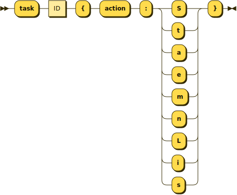
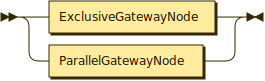
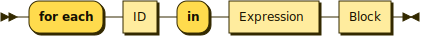

**Program:**


```
Program  ::= ImportList GlobalList EOF
```

**ImportList:**


```
ImportList
         ::= ImportDecl [ImportLisRe]
```

referenced by:

* Program

**ImportListRest:**


```
ImportListRest
         ::= ( ImportDecl | ImportJarDecl ) [ImportLisRe]
```

**ImportDecl:**


```
ImportDecl
         ::= 'import' STRING ['as ID] ';'?
```

referenced by:

* ImportList
* ImportListRest

**ImportJarDecl:**


```
ImportJarDecl
         ::= 'import_jar' STRING ['as ID] ';'?
```

referenced by:

* ImportListRest

**GlobalList:**


```
GlobalList
         ::= GlobalVarDecl
           | FunctionDecl
           | ProcessDecl [GlobaListRe]
```

referenced by:

* Program

**GlobalListRest:**


```
GlobalListRest
         ::= GlobalVarDecl
           | FunctionDecl
           | ProcessDecl [GlobaListRe]
```

**GlobalVarDecl:**


```
GlobalVarDecl
         ::= LValue '=' Expression ';'?
```

referenced by:

* GlobalList
* GlobalListRest

**FunctionDecl:**


```
FunctionDecl
         ::= 'function' ID '(' [ParmListOp]? ')' [ReturnTypO]? Block
```

referenced by:

* GlobalList
* GlobalListRest

**ParamListOpt:**


```
ParamListOpt
         ::= Param [ParmListRe]
```

**ParamListRest:**


```
ParamListRest
         ::= ',' Param [ParmListRe]
```

**Param:**


```
Param    ::= ID ':' TypeRef
```

referenced by:

* ParamListOpt
* ParamListRest

**ReturnTypeOpt:**


```
ReturnTypeOpt
         ::= '->' TypeRef
```

**TypeRef:**


```
TypeRef  ::= 'integer'
           | 'decimal'
           | 'boolean'
           | 'text'
           | 'list'
           | 'object'
           | 'void'
```

referenced by:

* Param
* ReturnTypeOpt

**ProcessDecl:**


```
ProcessDecl
         ::= 'process' ID '{' StartNode [ProcesInLit] EndList '}'
```

referenced by:

* GlobalList
* GlobalListRest

**ProcessInnerList:**


```
ProcessInnerList
         ::= ProcessInner [ProcesInLit]
```

**ProcessInner:**


```
ProcessInner
         ::= TaskNode
           | GatewayNode
```

referenced by:

* ProcessInnerList

**EndList:**


```
EndList  ::= EndNode [EndList]
```

referenced by:

* ProcessDecl

**StartNode:**


```
StartNode
         ::= 'start' '->' ID ';'?
```

referenced by:

* ProcessDecl

**EndNode:**


```
EndNode  ::= 'end' ID ';'?
```

referenced by:

* EndList

**TaskNode:**



```
TaskNode ::= 'task' ID '{' 'action' ':' [StaemnLis] '}'
```

referenced by:

* ProcessInner

**StatementList:**


```
StatementList
         ::= Statement [StaemnLis]
```

**GatewayNode:**



```
GatewayNode
         ::= ExclusiveGatewayNode
           | ParallelGatewayNode
```

referenced by:

* ProcessInner

**ExclusiveGatewayNode:**


```
ExclusiveGatewayNode
         ::= 'gateway' ID '{' GatewayWhenList [GatewyElsOp] '}'
```

referenced by:

* GatewayNode

**GatewayWhenList:**


```
GatewayWhenList
         ::= GatewayWhen [GatewyWhnLis]
```

referenced by:

* ExclusiveGatewayNode
* GatewayStmtExclusive

**GatewayWhen:**


```
GatewayWhen
         ::= 'when' Expression '->' ID ';'?
```

referenced by:

* GatewayWhenList

**GatewayElseOpt:**


```
GatewayElseOpt
         ::= GatewayElse?
```

**GatewayElse:**


```
GatewayElse
         ::= 'else' '->' ID ';'?
```

referenced by:

* GatewayElseOpt

**ParallelGatewayNode:**


```
ParallelGatewayNode
         ::= 'gateway' ID 'parallel' '{' GatewayBranchList GatewayJoin '}'
```

referenced by:

* GatewayNode

**GatewayBranchList:**


```
GatewayBranchList
         ::= GatewayBranch [GatewyBrnchLis]
```

referenced by:

* GatewayStmtParallel
* ParallelGatewayNode

**GatewayBranch:**


```
GatewayBranch
         ::= 'branch' '->' ID ';'?
```

referenced by:

* GatewayBranchList

**GatewayJoin:**


```
GatewayJoin
         ::= 'join' '->' ID ';'?
```

referenced by:

* GatewayStmtParallel
* ParallelGatewayNode

**Block:**


```
Block    ::= '{' [StaemnLis] '}'
```

referenced by:

* ElseIfList
* ElseOpt
* ForEachStmt
* ForRangeStmt
* FunctionDecl
* IfStmt
* TryCatchStmt
* WhileStmt

**Statement:**


```
Statement
         ::= AssignStmt
           | GotoStmt
           | IfStmt
           | WhileStmt
           | ForEachStmt
           | ForRangeStmt
           | TryCatchStmt
           | ThrowStmt
           | ReturnStmt
           | GatewayStmtInAction
           | BlockStmt
           | ExprStmt
```

referenced by:

* StatementList

**AssignStmt:**


```
AssignStmt
         ::= LValue '=' Expression ';'?
```

referenced by:

* Statement

**GotoStmt:**


```
GotoStmt ::= 'go_to' ID ';'?
```

referenced by:

* Statement

**IfStmt:**


```
IfStmt   ::= 'if' Expression Block [ElseIfLit] [ElseOpt]
```

referenced by:

* Statement

**ElseIfList:**


```
ElseIfList
         ::= 'else_if' Expression Block [ElseIfLit]
```

**ElseOpt:**


```
ElseOpt  ::= ( 'else' Block )?
```

**WhileStmt:**


```
WhileStmt
         ::= 'while' Expression Block
```

referenced by:

* Statement

**ForEachStmt:**



```
ForEachStmt
         ::= 'for each' ID 'in' Expression Block
```

referenced by:

* Statement

**ForRangeStmt:**


```
ForRangeStmt
         ::= 'for' ID 'from' Expression 'to' Expression ['step Exrion]? Block
```

referenced by:

* Statement

**TryCatchStmt:**


```
TryCatchStmt
         ::= 'try' Block 'catch' '(' ID ')' Block
```

referenced by:

* Statement

**ThrowStmt:**


```
ThrowStmt
         ::= 'throw' Expression ';'?
```

referenced by:

* Statement

**ReturnStmt:**


```
ReturnStmt
         ::= 'return' [Expresion] ';'?
```

referenced by:

* Statement

**GatewayStmtInAction:**


```
GatewayStmtInAction
         ::= GatewayStmtExclusive
           | GatewayStmtParallel
```

referenced by:

* Statement

**GatewayStmtExclusive:**


```
GatewayStmtExclusive
         ::= 'gateway' ID '{' GatewayWhenList [GatewyElsOp] '}'
```

referenced by:

* GatewayStmtInAction

**GatewayStmtParallel:**


```
GatewayStmtParallel
         ::= 'gateway' ID 'parallel' '{' GatewayBranchList GatewayJoin '}'
```

referenced by:

* GatewayStmtInAction

**Expression:**


```
Expression
         ::= OrExpr
           | AndExpr
           | EqExpr
           | RelExpr
           | AddExpr
           | MulExpr
           | UnaryNotExpr
           | UnaryMinusExpr
           | MemberAccessExpr
           | IndexAccessExpr
           | CallExpr
           | PrimaryExpr
```

referenced by:

* AssignStmt
* ElseIfList
* ForEachStmt
* ForRangeStmt
* GatewayWhen
* GlobalVarDecl
* IfStmt
* LValueRest
* ListExpression
* ListExpressionRest
* ObjectPair
* PrimaryExpr
* ThrowStmt
* WhileStmt

**PrimaryExpr:**


```
PrimaryExpr
         ::= '(' Expression ')'
           | ListLiteral
           | ObjectLiteral
           | Literal
           | 'input'
           | ID
```

referenced by:

* Expression

**ListLiteral:**


```
ListLiteral
         ::= '[' [ListExpreon] ']'
```

referenced by:

* PrimaryExpr

**ListExpression:**


```
ListExpression
         ::= Expression [ListExpreonR]
```

**ListExpressionRest:**


```
ListExpressionRest
         ::= ',' Expression [ListExpreonR]
```

**ObjectLiteral:**


```
ObjectLiteral
         ::= '{' [ObjectPairLs] '}'
```

referenced by:

* PrimaryExpr

**ObjectPairList:**


```
ObjectPairList
         ::= ObjectPair [ObjectPairLsR]
```

**ObjectPairListRest:**


```
ObjectPairListRest
         ::= ',' ObjectPair [ObjectPairLsR]
```

**ObjectPair:**


```
ObjectPair
         ::= ID ':' Expression
```

referenced by:

* ObjectPairList
* ObjectPairListRest

**Literal:**


```
Literal  ::= INT
           | DECIMAL
           | STRING
           | BOOL
           | 'null'
```

referenced by:

* PrimaryExpr

**LValue:**


```
LValue   ::= ID [LValueRst]
```

referenced by:

* AssignStmt
* GlobalVarDecl

**LValueRest:**


```
LValueRest
         ::= ( '.' ID | '[' Expression ']' ) [LValueRst]
```

## 
 <sup>generated by [RR - Railroad Diagram Generator][RR]</sup>

[RR]: https://www.bottlecaps.de/rr/ui